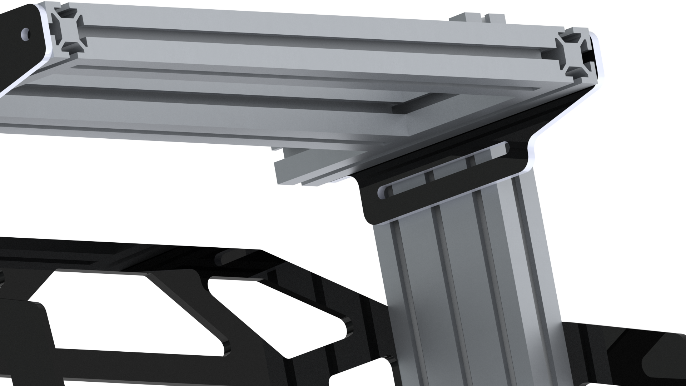
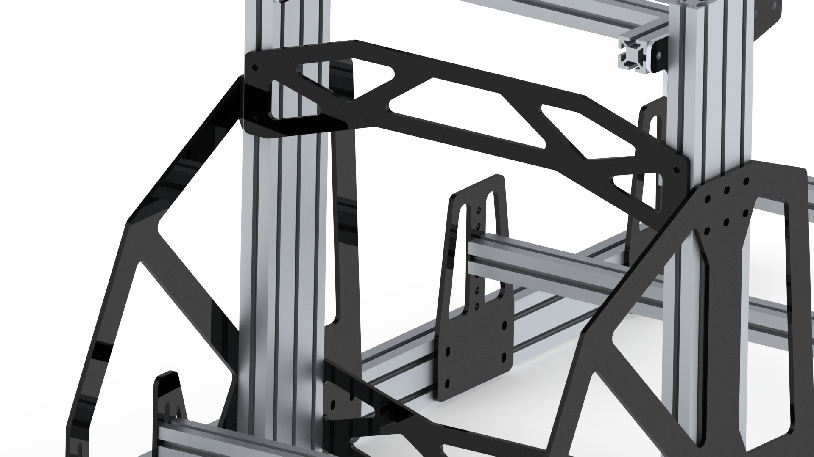
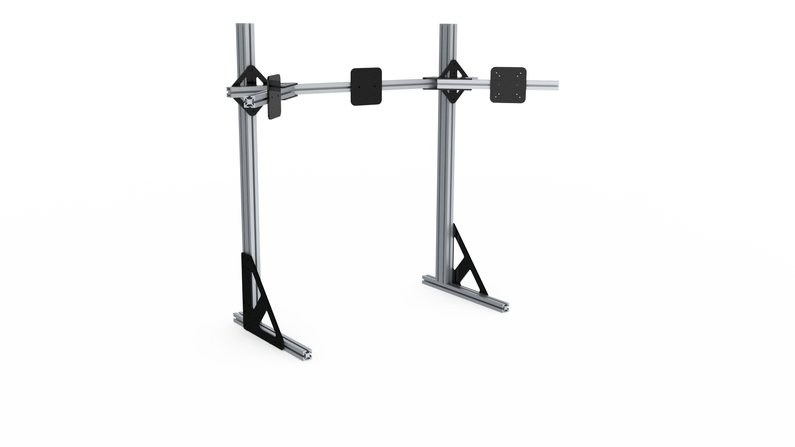
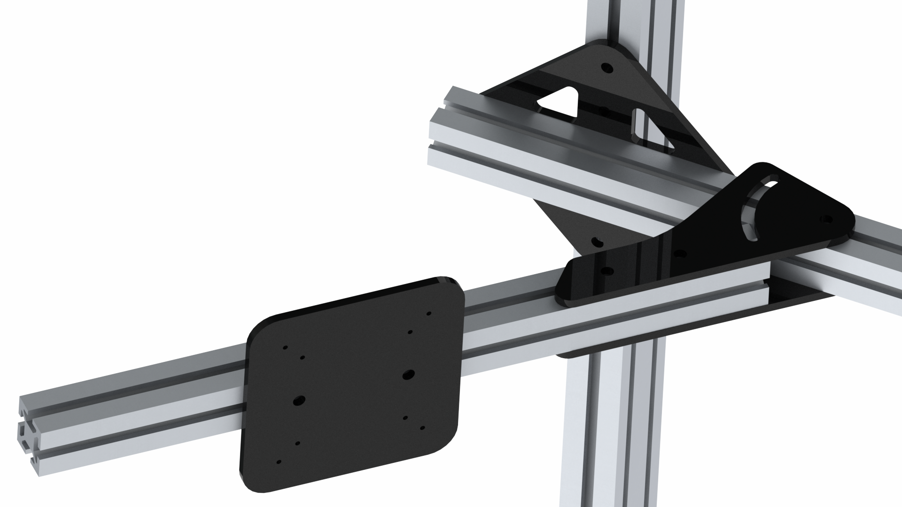

I want to share the my sim racing chassis design the sim racing desing with the rest of the community. I previously just shared renders of the build but haven't had the chance to compile the vector files (dxfs) for people to to cut there own custom custom parts. 

Between the above renders and the dxf files found here should be enough information to build your own. If you need dimensions of the aluminum extrusion please feel free to reach out to me on instagram below, provided below. 

[Vector Files / DXFs](https://google.com/){: .btn}

Below is a list of the DXFs and brief description. Cut in 1/4" Aluminum. The grade of aluminum doesn't really matter. It will be strong enough for this sim racing chassis. All DXF's are dimensioned in milimetre (mm) units

| File | Type | Quantity | Brief Description |
|-------|--------|---------|---------|
| CrossFrame-1.0.DXF | Chassis | 2 | Used above and below the knee area to ensure the frame doesn't rack |
| PedalPlate-1.0.DXF | Chassis | 2 | Second mounting point for the pedals |
| SeatPlate-1.0.DXF | Chassis | 4 | Seat frame is mounted to this |
| Sides-1.0.DXF | Chassis | 2 | Stiffens the chassis front to back |
| WheelAdjPlate.DXF | Chassis | 2 | Adjusts the wheel's height and angle |
| Actuator-1.0.DXF | Chassis | 2 | Used to attach D-Box to the chassis (Optional if you don't plan to use D-Box)|
| MonitorBottom-1.0.DXF |Monitor Mount | 2 | Connects the ground to the horizontal aluminum extrusion with the vertical pieces |
| MonitorMountAngleBracket3-1.0.DXF| Monitor Mount | 2 | Adjust the angle of the monitors |
| VerticalMonitor-1.0.DXF | Monitor Mount | 2 | Adjust the height of the monitors |
| VesaMounts-1.0.DXF | Monitor Mount | 3 | 3 required for triple monitor. 75 and 100 mm compatability  |

